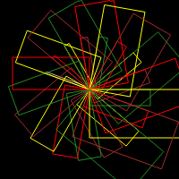

# README

This project is the first assignment for UNSW6991 Solving Modern Programming Problems with Rust. It is an incredible assignment that implements a interpreter for a new plot language.

The following knowledge I have put into the project:

- dynamic trait dispatch
- smart pointer
- lifetime
- ownership model
- modularity

Its final example program will produce the following figure which is interesting:



the following shows my `autotest` outcomes:

```shell
(base) ➜  rslogo git:(main) ✗ autotest
Found cargo project: rslogo
/tmp/tmp.PDXYtIiIL4
Located autotests for rslogo
./build_mark_wrapper.sh crate.tar
   Compiling mark_wrapper v0.1.0 (/tmp/tmpecjfwhzw/autotest/mark_wrapper)
    Finished `dev` profile [unoptimized + debuginfo] target(s) in 0.58s
cargo build --target-dir target # crate.tar
   Compiling bytemuck v1.15.0
   Compiling float-cmp v0.9.0
   Compiling simd-adler32 v0.3.7
   Compiling arrayvec v0.7.4
   Compiling crc32fast v1.4.0
   Compiling version_check v0.9.4
   Compiling libc v0.2.153
   Compiling cfg-if v1.0.0
   Compiling arrayref v0.3.7
   Compiling adler v1.0.2
   Compiling log v0.4.21
   Compiling siphasher v0.3.11
   Compiling bitflags v1.3.2
   Compiling unicode-general-category v0.6.0
   Compiling tinyvec_macros v0.1.1
   Compiling proc-macro2 v1.0.79
   Compiling rctree v0.5.0
   Compiling roxmltree v0.19.0
   Compiling tinyvec v1.6.0
   Compiling smallvec v1.13.2
   Compiling strict-num v0.1.1
   Compiling xmlparser v0.13.6
   Compiling miniz_oxide v0.7.2
   Compiling ttf-parser v0.19.2
   Compiling kurbo v0.9.5
   Compiling tiny-skia-path v0.10.0
   Compiling unicode-script v0.5.6
   Compiling unicode-bidi-mirroring v0.1.0
   Compiling unicode-ccc v0.1.2
   Compiling ttf-parser v0.18.1
   Compiling unicode-ident v1.0.12
   Compiling slotmap v1.0.7
   Compiling fdeflate v0.3.4
   Compiling simplecss v0.2.1
   Compiling roxmltree v0.18.1
   Compiling fontconfig-parser v0.5.6
   Compiling flate2 v1.0.28
   Compiling utf8parse v0.2.1
   Compiling unicode-bidi v0.3.15
   Compiling unicode-vo v0.1.0
   Compiling data-url v0.2.0
   Compiling svgtypes v0.11.0
   Compiling imagesize v0.12.0
   Compiling png v0.17.13
   Compiling memmap2 v0.6.2
   Compiling quote v1.0.35
   Compiling anstyle-parse v0.2.3
   Compiling anstyle v1.0.6
   Compiling weezl v0.1.8
   Compiling colorchoice v1.0.0
   Compiling base64 v0.21.7
   Compiling xmlwriter v0.1.0
   Compiling color_quant v1.1.0
   Compiling anstyle-query v1.0.2
   Compiling pico-args v0.5.0
   Compiling anstream v0.6.13
   Compiling syn v2.0.58
   Compiling rgb v0.8.37
   Compiling usvg-tree v0.35.0
   Compiling gif v0.12.0
   Compiling clap_lex v0.7.0
   Compiling jpeg-decoder v0.3.1
   Compiling strsim v0.11.1
   Compiling heck v0.5.0
   Compiling clap_builder v4.5.2
   Compiling usvg-parser v0.35.0
   Compiling tiny-skia v0.10.0
   Compiling rustybuzz v0.7.0
   Compiling fontdb v0.14.1
   Compiling usvg-text-layout v0.35.0
   Compiling clap_derive v4.5.4
   Compiling usvg v0.35.0
   Compiling resvg v0.35.0
   Compiling unsvg v1.1.2
   Compiling clap v4.5.4
   Compiling rslogo v0.1.0 (/tmp/tmpecjfwhzw/autotest)
    Finished `dev` profile [unoptimized + debuginfo] target(s) in 7.99s
Test 0 (mark_wrapper/target/debug/mark_wrapper EXPECT_OK ./target/debug/rslogo output.svg logo_examples/0_00_empty_file.lg output.svg 200 200) - passed
Test 1 (mark_wrapper/target/debug/mark_wrapper EXPECT_OK ./target/debug/rslogo output.svg logo_examples/0_01_comments_only.lg output.svg 200 200) - passed
Test 2 (mark_wrapper/target/debug/mark_wrapper EXPECT_OK ./target/debug/rslogo output.svg logo_examples/1_00_penup_pendown.lg output.svg 200 200) - passed
Test 3 (mark_wrapper/target/debug/mark_wrapper EXPECT_OK ./target/debug/rslogo output.svg logo_examples/1_01_setpencolor.lg output.svg 200 200) - passed
Test 4 (mark_wrapper/target/debug/mark_wrapper EXPECT_OK ./target/debug/rslogo output.svg logo_examples/1_02_forward_back.lg output.svg 200 200) - passed
Test 5 (mark_wrapper/target/debug/mark_wrapper EXPECT_OK ./target/debug/rslogo output.svg logo_examples/1_03_left_right.lg output.svg 200 200) - passed
Test 6 (mark_wrapper/target/debug/mark_wrapper EXPECT_OK ./target/debug/rslogo output.svg logo_examples/1_04_turn_rel.lg output.svg 200 200) - passed
Test 7 (mark_wrapper/target/debug/mark_wrapper EXPECT_OK ./target/debug/rslogo output.svg logo_examples/1_05_setheading_abs.lg output.svg 200 200) - passed
Test 8 (mark_wrapper/target/debug/mark_wrapper EXPECT_OK ./target/debug/rslogo output.svg logo_examples/1_06_setx_sety.lg output.svg 200 200) - passed
Test 9 (mark_wrapper/target/debug/mark_wrapper EXPECT_OK ./target/debug/rslogo output.svg logo_examples/1_07_combo.lg output.svg 200 200) - passed
Test 10 (mark_wrapper/target/debug/mark_wrapper EXPECT_OK ./target/debug/rslogo output.svg logo_examples/1_08_harder_combo.lg output.svg 200 200) - passed
Test 11 (mark_wrapper/target/debug/mark_wrapper EXPECT_ERROR ./target/debug/rslogo output.svg logo_examples/1_09_too_many_args_err.lg output.svg 200 200) - passed
Test 12 (mark_wrapper/target/debug/mark_wrapper EXPECT_ERROR ./target/debug/rslogo output.svg logo_examples/1_10_too_many_args_2_err.lg output.svg 200 200) - passed
Test 13 (mark_wrapper/target/debug/mark_wrapper EXPECT_ERROR ./target/debug/rslogo output.svg logo_examples/1_11_wrong_type_err.lg output.svg 200 200) - passed
Test 14 (mark_wrapper/target/debug/mark_wrapper EXPECT_ERROR ./target/debug/rslogo output.svg logo_examples/1_12_not_enough_args_err.lg output.svg 200 200) - passed
Test 15 (mark_wrapper/target/debug/mark_wrapper EXPECT_ERROR ./target/debug/rslogo output.svg logo_examples/1_13_wrong_type_err.lg output.svg 200 200) - passed
Test 16 (mark_wrapper/target/debug/mark_wrapper EXPECT_OK ./target/debug/rslogo output.svg logo_examples/2_00_penup_pendown_vars.lg output.svg 200 200) - passed
Test 17 (mark_wrapper/target/debug/mark_wrapper EXPECT_OK ./target/debug/rslogo output.svg logo_examples/2_01_setpencolor_vars.lg output.svg 200 200) - passed
Test 18 (mark_wrapper/target/debug/mark_wrapper EXPECT_OK ./target/debug/rslogo output.svg logo_examples/2_02_moving_vars.lg output.svg 200 200) - passed
Test 19 (mark_wrapper/target/debug/mark_wrapper EXPECT_ERROR ./target/debug/rslogo output.svg logo_examples/2_03_missing_var_err.lg output.svg 200 200) - passed
Test 20 (mark_wrapper/target/debug/mark_wrapper EXPECT_OK ./target/debug/rslogo output.svg logo_examples/2_04_queries.lg output.svg 200 200) - passed
Test 21 (mark_wrapper/target/debug/mark_wrapper EXPECT_OK ./target/debug/rslogo output.svg logo_examples/2_05_addassign.lg output.svg 200 200) - passed
Test 22 (mark_wrapper/target/debug/mark_wrapper EXPECT_ERROR ./target/debug/rslogo output.svg logo_examples/2_06_unknownaddassign_err.lg output.svg 200 200) - passed
Test 23 (mark_wrapper/target/debug/mark_wrapper EXPECT_OK ./target/debug/rslogo output.svg logo_examples/3_00_simple_if.lg output.svg 200 200) - passed
Test 24 (mark_wrapper/target/debug/mark_wrapper EXPECT_OK ./target/debug/rslogo output.svg logo_examples/3_01_double_if.lg output.svg 200 200) - passed
Test 25 (mark_wrapper/target/debug/mark_wrapper EXPECT_OK ./target/debug/rslogo output.svg logo_examples/3_02_nested_if.lg output.svg 200 200) - passed
Test 26 (mark_wrapper/target/debug/mark_wrapper EXPECT_OK ./target/debug/rslogo output.svg logo_examples/3_03_single_loop.lg output.svg 200 200) - passed
Test 27 (mark_wrapper/target/debug/mark_wrapper EXPECT_OK ./target/debug/rslogo output.svg logo_examples/3_04_zero_loop.lg output.svg 200 200) - passed
Test 28 (mark_wrapper/target/debug/mark_wrapper EXPECT_OK ./target/debug/rslogo output.svg logo_examples/3_05_spiral.lg output.svg 200 200) - passed
Test 29 (mark_wrapper/target/debug/mark_wrapper EXPECT_OK ./target/debug/rslogo output.svg logo_examples/3_06_spiral2.lg output.svg 200 200) - passed
Test 30 (mark_wrapper/target/debug/mark_wrapper EXPECT_ERROR ./target/debug/rslogo output.svg logo_examples/3_07_invalid_if_err.lg output.svg 200 200) - passed
Test 31 (mark_wrapper/target/debug/mark_wrapper EXPECT_ERROR ./target/debug/rslogo output.svg logo_examples/3_08_invalid_while_err.lg output.svg 200 200) - passed
Test 32 (mark_wrapper/target/debug/mark_wrapper EXPECT_OK ./target/debug/rslogo output.svg logo_examples/4_00_basic_arithmetic.lg output.svg 200 200) - passed
Test 33 (mark_wrapper/target/debug/mark_wrapper EXPECT_OK ./target/debug/rslogo output.svg logo_examples/4_01_basic_arithmetic_neg.lg output.svg 200 200) - passed
Test 34 (mark_wrapper/target/debug/mark_wrapper EXPECT_OK ./target/debug/rslogo output.svg logo_examples/4_02_logical_and.lg output.svg 200 200) - passed
Test 35 (mark_wrapper/target/debug/mark_wrapper EXPECT_OK ./target/debug/rslogo output.svg logo_examples/4_03_logical_or.lg output.svg 200 200) - passed
Test 36 (mark_wrapper/target/debug/mark_wrapper EXPECT_OK ./target/debug/rslogo output.svg logo_examples/4_04_nested_if.lg output.svg 200 200) - passed
Test 37 (mark_wrapper/target/debug/mark_wrapper EXPECT_OK ./target/debug/rslogo output.svg logo_examples/4_05_mixed_logic.lg output.svg 200 200) - passed
Test 38 (mark_wrapper/target/debug/mark_wrapper EXPECT_OK ./target/debug/rslogo output.svg logo_examples/4_06_mixed_logic_2.lg output.svg 200 200) - passed
Test 39 (mark_wrapper/target/debug/mark_wrapper EXPECT_OK ./target/debug/rslogo output.svg logo_examples/4_07_complex_1.lg output.svg 200 200) - passed
Test 40 (mark_wrapper/target/debug/mark_wrapper EXPECT_OK ./target/debug/rslogo output.svg logo_examples/4_08_ne_check.lg output.svg 200 200) - passed
Test 41 (mark_wrapper/target/debug/mark_wrapper EXPECT_OK ./target/debug/rslogo output.svg logo_examples/4_09_spiral.lg output.svg 200 200) - passed
Test 42 (mark_wrapper/target/debug/mark_wrapper EXPECT_OK ./target/debug/rslogo output.svg logo_examples/5_00_boxes.lg output.svg 200 200) - passed
Test 43 (mark_wrapper/target/debug/mark_wrapper EXPECT_OK ./target/debug/rslogo output.svg logo_examples/5_01_boxes2.lg output.svg 200 200) - passed
Test 44 (mark_wrapper/target/debug/mark_wrapper EXPECT_ERROR ./target/debug/rslogo output.svg logo_examples/5_02_invalid_err.lg output.svg 200 200) - passed
Test 45 (mark_wrapper/target/debug/mark_wrapper EXPECT_ERROR ./target/debug/rslogo output.svg logo_examples/5_03_invalid_end_err.lg output.svg 200 200) - passed
Test 46 (mark_wrapper/target/debug/mark_wrapper EXPECT_OK ./target/debug/rslogo output.svg logo_examples/5_04_star.lg output.svg 200 200) - passed
47 tests passed 0 tests failed

```
