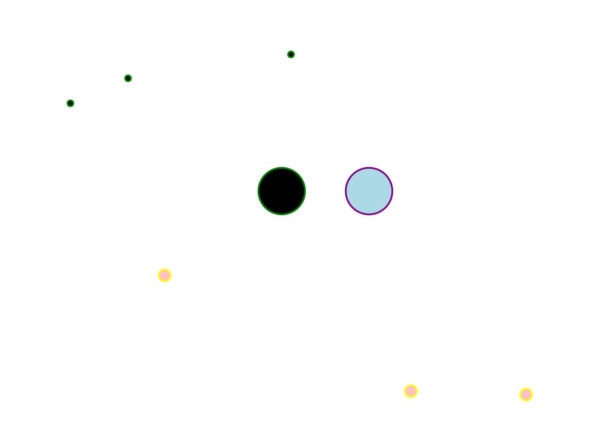

# README

**Finished all Tasks!!!!!!!!!**

- [X] Understanding
- [X] starting
- [X] removing the Enum `ObjectType`
- [X] refactor the behaviors as `CelestialObject` trait
- [X] introduce `GravitySouce` trait
- [X] introduce `GravityReceiver` trait
- [X] **Entension** introduce `GravityObject` general trait

## Task 1: Understanding The Code You Have Been Provided

In the library you have been provided, there are two types of object defined in an enum. Planets do not move, but apply gravity to other objects. Asteroids move with a certain initial velocity, and are affected by gravity.

Since the enum is defined by the library, it is not possible to extend the library's behaviour to include different object types. In this task, you will modify the code so that it can support user-defined objects.

## Task 2: Starting the simulator

In your starter code, you have been provided an HTML file called "phys_simulator.html". Open this file in your web browser to see a simulation of planets orbiting a star on your screen. You will see the small dots (asteroids), orbiting the large dot (planet).

## Task 3: Removing the Enum

In the current code, you've been provided the ObjectType enum. As a user of the library, this gives you very little flexibility on what you can simulate: you are limited to asteroids and planets. In this workshop, we will be making the library more flexible, such that a user could implement their own types of celestial objects.

For the moment, we'll be changing our code so we can model objects which are affected by gravity, and which provide gravity. By the end of the tutorial, we'll be able to model any object that does both, but for now this allows us to make small changes to our code in each step.

Therefore, refactor the code so that rather than taking a vec of enums, it takes a vec of Planets, and a vec of Asteroids. Once you are done, you should be able to entirely remove the ObjectType enum.

## Task 4: Defining Shared Behaviour

You'll notice that both Planets and Asteroids share code which defines their position, and converts them into a Circle struct to be sent to the front-end. This is shared behaviour which we can use a trait to represent.

Refactor the code so that Planets and Asteroids share a trait which defines their position, and allows conversion into a Circle.

## Task 5: Refactoring Planets

Now we are ready to refactor our code to have the relevant code for Planets be more general. Refactor the code by defining a trait which means that any object which is a "gravity source" can be passed in the place of a planet.

To test our refactoring, we're going to implement a new type of gravity source which is not a planet. This type of gravity source should pulse (i.e. have high gravity, then low gravity, then high again).

## Task 6: Refactoring Asteroids

Similarly to task 5, refactor the code so that any object which is a "gravity receiver" can be passed in the place of an Asteroid.

Implement an Asteroid which is only affected by gravity when it's further away than 100 units from a gravity source.

## Task 7: (Extension) Combining Gravitational Objects With One Trait

This task is an extension, and requires a little bit of "outside the Box" thinking (hey, it's a pun!). So far, we've made Gravity Sources and Gravity Receivers be two seperate traits. Rust's ownership model means that something cannot be both a source and a receiver. In order to fix this, we can make a new trait called something like GravityObject, which allows the implementor to declare whether an object is a source, receiver, or both.

To do this, write a trait which has two functions. One function should return an Option<&dyn GravitySource>, the other should return a Option<&dyn GravityReceiver>. You can then implement this function on objects which implement either trait, to help figure out what sort of object they are.

Once you've done this, the code can take a single vector of GravityObjects, rather than one of Sources and one of Receivers.
